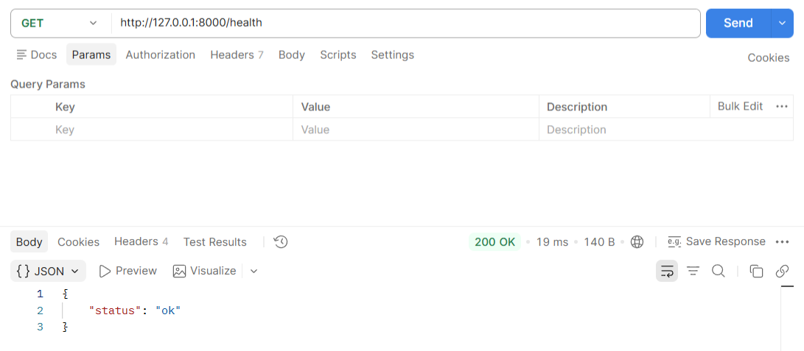
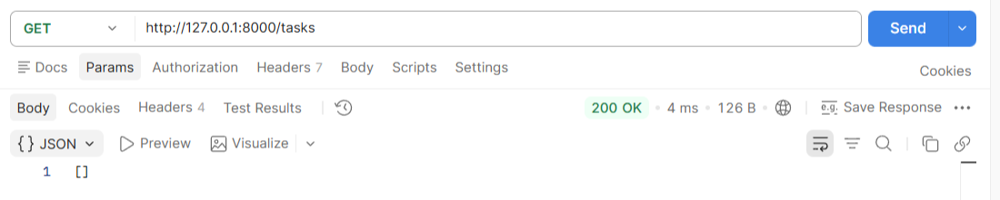
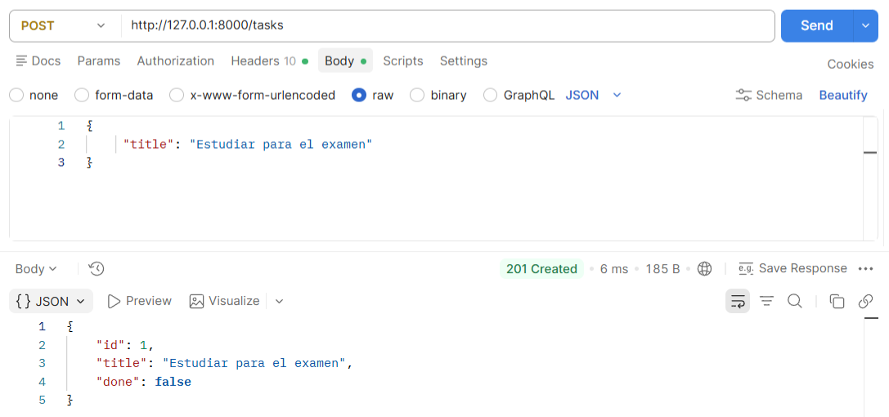
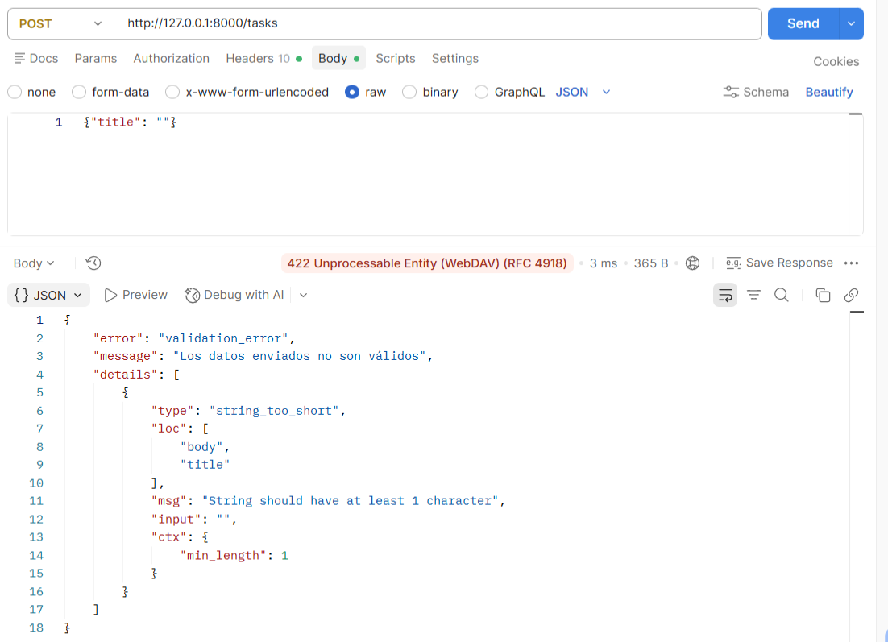
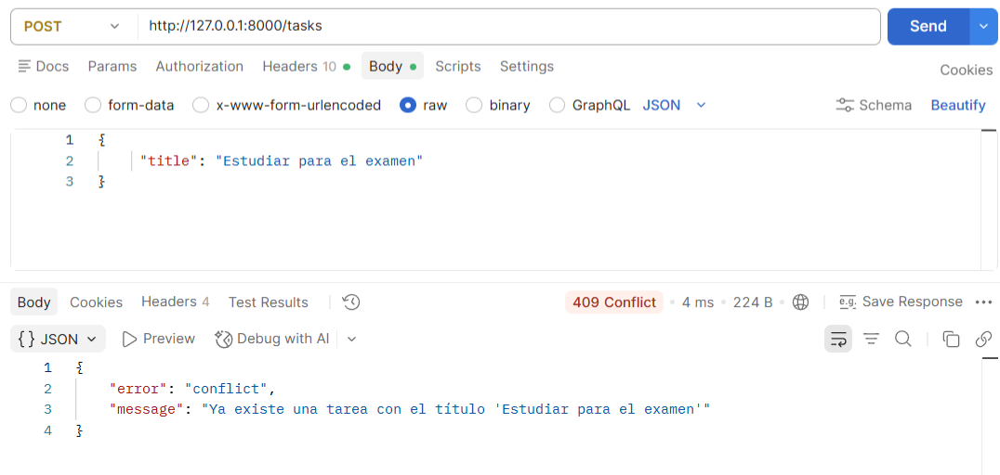
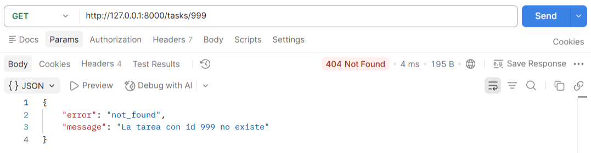
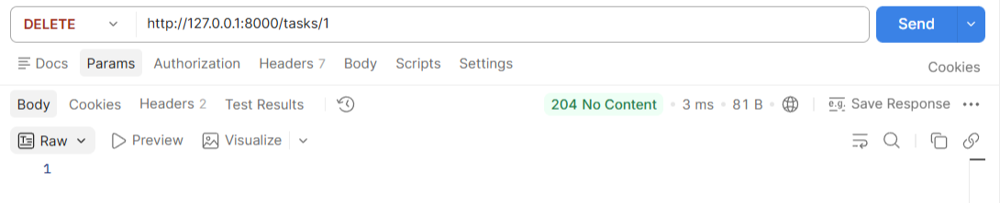

# Task Manager API

## Descripción del ejemplo

     - ¿Qué es esta API y qué gestiona?

        Esta API es un servicio REST desarrollado con FastAPI para la gestión de tareas. Permite crear, consultar, actualizar y eliminar tareas mediante endpoints HTTP. Además de las operaciones básicas CRUD, la aplicación incorpora validaciones y manejo explícito de errores para garantizar respuestas claras y coherentes ante diferentes situaciones.
        Su propósito principal es servir como ejemplo práctico del manejo adecuado de solicitudes y respuestas en una API web moderna.

     - ¿Por qué la construyeron así (con manejo explícito de cada código de estado)?

        La API fue diseñada para devolver un código de estado HTTP específico según el resultado de cada operación. En lugar de responder siempre con un mismo código o depender únicamente de errores genéricos, cada situación se representa mediante el código más apropiado.

        Por ejemplo:

        200 OK: cuando una operación se realiza correctamente.
        201 Created: cuando se crea una nueva tarea.
        204 No Content: cuando una tarea se elimina exitosamente.
        404 Not Found: cuando se solicita una tarea que no existe.
        409 Conflict: cuando se intenta crear una tarea con un título que ya existe.
        422 Unprocessable Entity: cuando los datos enviados no cumplen las validaciones definidas.
        500 Internal Server Error: para errores inesperados del servidor.

        Este enfoque mejora la comunicación entre el cliente y la API, facilita la depuración y sigue las buenas prácticas del desarrollo de servicios REST.

     - ¿Qué relación tiene con el tema "Códigos de estado HTTP y manejo adecuado
       de respuestas en APIs"?

       Este proyecto aplica directamente los conceptos de códigos de estado HTTP y manejo adecuado de respuestas en APIs. Cada endpoint fue diseñado para representar correctamente el resultado de una petición utilizando el código de estado más adecuado para cada escenario.
       De esta manera, la API no solo realiza operaciones sobre tareas, sino que también sirve como ejemplo práctico de cómo una aplicación puede comunicar éxito, errores de validación, conflictos y fallos internos mediante respuestas HTTP estandarizadas. Esto permite que clientes, aplicaciones y desarrolladores interpreten fácilmente el resultado de cada solicitud y reaccionen de forma adecuada.

## Tecnologías utilizadas

- **Python 3.13**
- **FastAPI** — framework para construir la API REST
- **Pydantic** — validación de datos y modelos de entrada/salida
- **Uvicorn** — servidor ASGI para ejecutar la aplicación

## Estructura del proyecto

task-manager-api/
├── app/
│ ├── init.py
│ ├── main.py # endpoints y manejo de códigos de estado
│ ├── models.py # almacenamiento en memoria (TaskStore)
│ └── schemas.py # modelos Pydantic (validación)
├── requirements.txt
└── README.md

## Pasos para ejecutar el proyecto

1. Clonar el repositorio y entrar a la carpeta del proyecto.
2. Crear y activar un entorno virtual:
```powershell
   python -m venv venv
   venv\Scripts\activate
```
3. Instalar dependencias:
```powershell
   pip install -r requirements.txt
```
4. Levantar el servidor:
```powershell
   uvicorn app.main:app --reload --reload-dir app
```
5. La API queda disponible en `http://127.0.0.1:8000`, con documentación interactiva en `http://127.0.0.1:8000/docs`.

## Endpoints y códigos de estado

| Método | Ruta | Código éxito | Código(s) de error | Descripción |
|---|---|---|---|---|
| GET | `/health` | 200 | — | Verifica que el servicio está disponible |
| GET | `/tasks` | 200 | — | Lista todas las tareas |
| GET | `/tasks/{id}` | 200 | 404 | Obtiene una tarea por id |
| POST | `/tasks` | 201 | 422, 409 | Crea una tarea (422 si el título es inválido, 409 si ya existe) |
| PUT | `/tasks/{id}` | 200 | 404 | Actualiza una tarea existente |
| DELETE | `/tasks/{id}` | 204 | 404 | Elimina una tarea |
| GET | `/debug/boom` | — | 500 | Endpoint de demostración: error interno manejado |

## Comandos necesarios (evidencia de funcionamiento)

A continuación, la secuencia completa de pruebas ejecutada con `curl`, mostrando cada código de estado en acción:

**1. Health check → 200 OK**


**2. Listar tareas (vacío) → 200 OK**


**3. Crear tarea válida → 201 Created**


**4. Crear tarea con título vacío → 422 Unprocessable Content**


**5. Crear tarea con título duplicado → 409 Conflict**


**6. Buscar tarea inexistente → 404 Not Found**


**7. Eliminar tarea existente → 204 No Content**


**8. Error interno simulado → 500 Internal Server Error**
